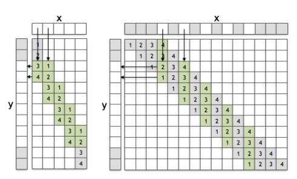
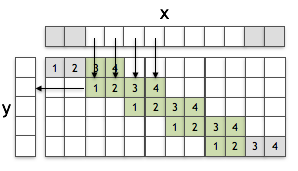
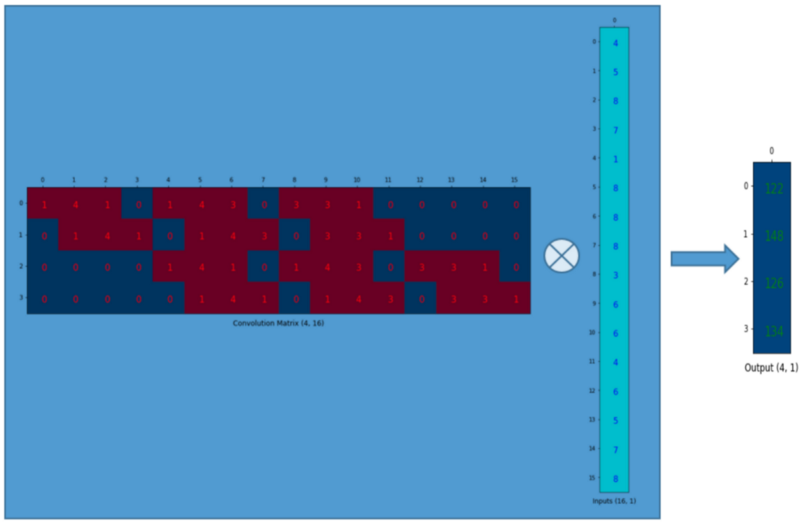
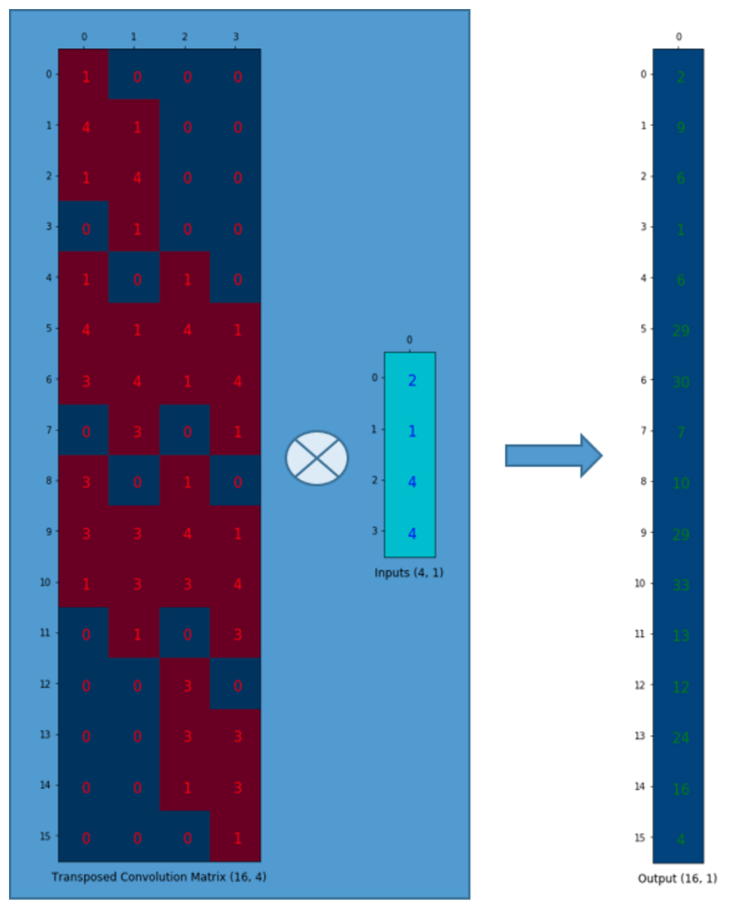
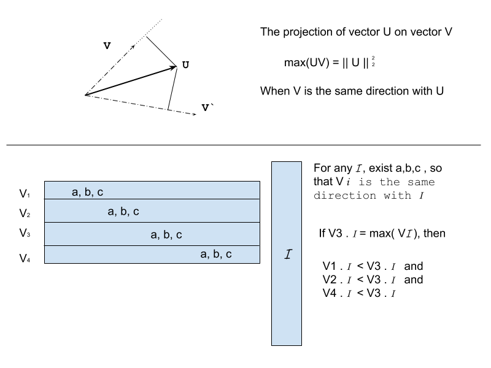

--------------
0. If you find some error in following content I will be really appreciate if you could start an issue or notfiy me by what every means.    
1. This doc is from rewriting of all my notes in google docs for reminding myself for future reference, so it will be updated when necessary.    
2. By the time I need this doc, it is highly likely that the only thing I could remember is that I use to know what being recorded here very well. Therefore:  
    - Notation will be as simple as possible.
    - Equation will be as easy understanding as possible.    

3. All recorded below is my personal understanding and has not been reviewed by many other expert seriously.  
4. If you would like to use any graph or equation below, please help yourself and being mentioned somewhere in your work would be great also.    
--------------

# Convolution
`convolution in *artificial neural network*`

**This is an intuitive explination**   
**This is an intuitive explination**   
**This is an intuitive explination**   

## Basic Assumption
All discussion in this section is based upon the belief of the following assumption:

> **_Complexity is the composition of limited set of simplicities_**.

More specifically, simplicity comes first, then composition of sufficient amount of different simplicities is the necessary condition for the emerge of complexity *(What is simplicity and Complexity? How could they be measured ? These will be discussed later)*.

- Lines and curves to figures
- Letters to literatures
- Syllables to languages  

  > It is possible that different language contains different set of syllables, some syllables in one language is not existed in another language, but each of these languese are all composed with limited set of syllables.

I will use **Elementary Feature** and **Higher Level Feature** instead of **Simplicity** and **Complexity** in the following discussion. Generally speaking, 'Feature Level' is a relative concept. Such as the VGG 16 feature map .

## The binding problem
Firstly, I will give a intuitive disucssion about a problem of the Fully Connected network (usually being referred as FC network).

Assuming that we have somehow trained this network successfully, so that in layer N of this network, there are invariant representations of all elementary features, and when being activated, neuron $\alpha_1$  is the only representation of a vertical bar in the input layer `I` and neuron $\alpha_2$ is the only representation of a horizontal bar in the input layer I.  In other words, if there is any vertical bar shows up in the input layer, no neuro other than $\alpha_1$ will be activated, so the same as $\alpha_2$ to a horizontal bar.

> Thans for Dr Simon Stringer's [talk](https://www.youtube.com/watch?v=j4kjGso_Ze0&t=183s) and the example of letters `'T'` and `'L'`.

If our input image contains only one English letter, then it is possible that ,in layer `N+`, there is a neuron $\beta_1$ which is the only representation of a letter `‘T’` and its activation status depends on both $\alpha_1$ and $\alpha_2$.

Now the question is : In layer `N+`, could there be another neuron $\beta_2$ whose activation status depends on neurons $\alpha_1$ and $\alpha_2$ and it is the only representation of letter `‘L’` in input layer I.

It is apparently that the representation of letter ‘L’ cannot depends on the combination of $\alpha_1$ and $\alpha_2$ , otherwise it will bring ambiguity.

The simplest solution is to have one more neuron that represent either vertical bar or horizontal bar.  Such as in figure below. In this case, neuron $\alpha_2$ and $\alpha_3$ both represent horizontal bar, furthermore they also carry composition information that indicate the role of horizontal bar in different context (`'L'` or `'T'`) repectively.

Of course, it it a common sense that different objects (higher level feature) have different parts, but as the feature level goes higher and higher, more and more basic elementary features will take part in the composition of more and more higher level features. For instance, as shown in figure below, the composition information seems to be not necessary. Because the Optimus Prime has a [Barrage cannon](https://tfwiki.net/wiki/Barrage_cannon) while a truck does not. In addition, a truck carries a cargo, while the Optimus Prime does not. However, it is highly likely that the barrage cannon and the trailer share a lot elementray features. Thus, introducing composition information will be inevitable in a deep architecture.

Now we know, in a fully connected neuron network, duplicated representations of same elementary features are necessary for expressing composition information (context information). But how much trouble it would bring into the network?

Intuitively, the matrix above shows relation between higher level features in a certain layer and elementary features one layer below.
$O_1$ to $O_i$ are different features, $i$ is the index. If two features share exactly same set of elementary features, then there will be at least one replicated representation of an elementary features to provide extra composition information.

For example, $O_1$ and $O_2$ are presented by same set of elementary features, then there will be one extra elementary feature that carrying composition information. $O_1$ and $O_3$ might depends on not exactly the same set of elementary features, then it is not necessary to have an extra replicated feature.

Assume, there is a new feature $O_{i+1}$ that need to be represented by neurons in this layer `M` and features $O_{i+1}$, $O_i$, $O_2$ are all composed with same set of features, therefore the minimun number of replicated features in previous layer after introducing $O_{i+1}$ is as shown in figure above.

This is just the relation between two adjacent layers, the need for extra features will be augmented as the layer goes down. For example, feature $O_{i+1}$ is in layer `M`, the matrix indicates that we need at least two replicated representation in layer `M-1`, and each of these `M-1` features might need a certain number of replicated represent of their own in layer `M-2`.

So, for a artifical neuron network with deep architecture:   
- From top to buttom, The necessary replication of different features will increase dramatically.
- From buttom to Top, the search time of certain higher level feature will be increase as well.

It would be easily lead to combinatorial explosion on both space and time complexity.

The consequence is: It would be extremmly hard to train. This is part of the reason there are all different kinds of feature map, but none of them is trained on a `'Fully Connected'` network.

This section is just an **Intuitive Explanation** of the binding problem in `Fuclly Connected` **Deep Neural Network**. In real world the case would be much more complicated:

- Features could be represented by a set of neurons.
- Contrains will limited the amount of distinguishable feature representations, such as regularization.

## Convolution ! What is it good for?
Convolution is one solution which would so the problem above.

The basic assumption of using CNN is:
> There are intrinsic strucutre in input data.

It is equavlient to the assumption at the begining of this doc.
> **_Complexity is the composition of limited set of simplicities_**.

## convolution
kernel is fitler with smaller dimension compare with input channel. Conceptually, intuitively, each each kernel could take input from multiple channles and its output is a unique channel, thus:
- Each output channel is a detector of lower level feature(s). The output channel of preserves the composition information in the original input(from one or multiple channels).
- Different channels are different viewpoints

Usually, the kernel is of the following shape:   
`(o,i,x,y)`
- `o`: number of `output` channels.
- `i`: number of `input` channels.
- `x`: kernel size along `x` axis.
- `y`: kernel size along `y` axis.

So, the total number of parameters in one convolutionary layer is

> $o * i * x * y$

`kernel` $k$ response for detecting `vertical bar` only. Therefore, the output of kernel $k$ actually contains not only the representation of vertical bar but also the position information of vertical bar.

So `kernel` $k+1$ could response for detecting `horizontal bar` only. Therefore, `kernel` $K$ in this case is of the size `(1,2,x,y)`, 1 input channel and 2 output channels. And layer `N+` is capable of representing letter `T` and `L` at the same time.

Intuitively, the entrie conv and pooling operation can be very well explained by example above.

## Transpose convolution (deconvolution)
The following picture comes from two great tutorials about convolution and transpose convolution:

- [Is the deconvolution layer the same as convolution layer](https://arxiv.org/pdf/1609.07009.pdf)
  - convolution

  - transpose convolution

- [up-sampling with transpose convolution](https://towardsdatascience.com/up-sampling-with-transposed-convolution-9ae4f2df52d0)
  - convolution

  - transpose convolution

In the above two examples, input is reshaped as an vector and the `moving filter operation` of a `kernel` is equalivent to an matrix as being shown above. So the ouput is the output of one channel.

It is obviously what `convolution` and `transpose convolution` mean ~!

But, what is `convolution` and `transpose convolution ` mean ?

officially:
> we assume the input the a result of down-sample of the output, and now we would like to retrive output (doing up-sampling) ...

Actually:

- for transpose convolution:    
    - As long as the kernel is not all zero. it must be a injective mapping (monomorphism), and mornomorphism guarantee the information got preserved and not need to know global information.
    - Though, there might be nonlinear activation function after the affline transformation, as long as the output dimensionallity is high enough, monomorphism can be guranteed.

- for convolution:     
  Even though , it detect possible elemenary strucutre, it would be better if it being used together with `max pooling`. The reason is :

  - the non-zeros velue of each row vectors (above) are the same by order.
  - Therefore, there is a unique maximum value in only one dimension which correspond to input vectors of certain direction.
  
  - Therefore, convolution layer equavlient to sujective mapping (epimorphism), which implies the knowledge of global information.

## arithematic
The computation along x axis and y axis are independent, so they can be described in the same way as:

tired....
[doc](https://arxiv.org/pdf/1603.07285.pdf)

## details
TO DO

## affine transformation
TO DO
## **Others**

polychronization it is not the only solution.
