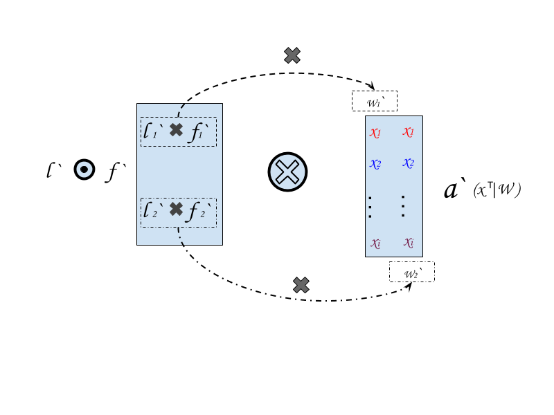

--------------

This doc is from rewriting of all my notes in google docs for reminding myself for future reference, so it will be updated when necessary.

By the time I need this doc, it is highly likely that the only thing I could remember is that I use to know what being recorded here very well. Therefore:

notation will be as simple as possible.

equation will be as easy understanding as possible.

All recorded below is my personal understanding and has not been reviewed by many other expert seriously.

--------------
# BP algorithm
BP could be the ab
Back propagation is being know as pass the gradient of a network
Belief propagation is ... ok something else.

##1. Back propagation

### Simple Fact

- Dot product and Derivatives

  - Dot product : Origin from [Hamiltonian quaternions](https://en.wikipedia.org/wiki/Classical_Hamiltonian_quaternions)
  - Vector Matrix product:
    From the affine transformation point of view:

    - $y=W \cdot x$ : `Column Vector`   
      transform basic unit vector of $x$ to $W$.

    - $y=x \cdot W$ : `Row Vector`  
      The same as above

  - Derivatives: See details [here](http://cs231n.stanford.edu/vecDerivs.pdf)
    - treat **Vector** (both `Column` and `Row` vector) as variable, then:   
      [$\frac{d y}{dx} = W$](http://cs231n.stanford.edu/vecDerivs.pdf).
         
      [(image above from: here)](http://cs231n.stanford.edu/vecDerivs.pdf).

    - treat **Matrix** W as variable, then:   
      - `Column Vector production`: $y = W \cdot x$   
        $\frac{dy}{dW} = x^T|W$
      - `Row Vector production` : $y = x \cdot W$   
        $\frac{dy}{dW} = x^T|W$

      Details is also in [here](http://cs231n.stanford.edu/vecDerivs.pdf).

      $x^T|W$ is my notation for remembering the result of this derivatives.
      it means transpose $x$ and replicate the value of each dimension so $X^T|W$ will be a matrix that has the same shape as W.
      
      The image above show $x^T|W$ in a normal case, if $W$ is simplified as a vector, then $x^T|W$ will just be $X^T$.

      The Transpose operation is necessary so .....
- Notations
  - a : short for **affine transformation**
  - $a = a(x|W)$ , then $a^\prime=\frac{dt}{dx}$
    - I use 'at' instead of 'y', and use the notation ' $|$ ' instead of ' $;$ ', to remind myself that $W$ as the only trainable parameter of the model ($b$ is another actually), after training, it encoded the background knowledge of the context in which we collected our training samples.
  - $f = f(a_i),a_i \in at$, then $f^\prime=\frac{df}{da}$   
    f could be any differentiable function, and it is an element-wise operation on `a`.
  - $l=l(f,t)$, then $l^\prime=\frac{dl}{df}$   
    $l$ is the loss function, a metric which give an scale value to represent difference between $l$ and $t$, $t$ is the target value, in supervised learning $t$ will be labels, either categorical label or real value for regression problem. In unsupervised learning, $t$ could be $x$ or some other value.

  

  basically a single layer one dimensional output fully connected neuron network would be like the simplified W in the image above, in this case $y = f(a) = f(a(x|W))$

- I will use **row vector**, so it would keep consistent with tensorflow and other real world utilities.
### Start from the final layer.
  - what we want : $\frac{dl}{dW}$
  - Chain rule:
    - $\frac{dl}{dW} = \frac{dl}{da}\frac{da}{dW}$  `Eq.1`

      we know $\frac{da}{dW}=x^T|W$ then:   
    - $\frac{dl}{dW} = \frac{dl}{da}x^T|W$  `Eq.2`
    - $\frac{dl}{dW} = \frac{dl}{df}\frac{df}{da}x^T|W = l^\prime \bigodot f^\prime \cdot X^T|W$  `Eq.3`

#### 1. single layer , one output.
Say, if we feed one record to the network below, then:
> we treat input to each layer as a row vector, therefore $a=x \cdot W$

- $x^T|W$ is just $X^T$
- $\frac{dl}{df}$ is a scale value or say 1d vector.
- $\frac{df}{da}$ is also a scale value or 1d vector

So, for a simplified network with a single layer and 1d output,
if the input is $x_1$ and t is $y_1$, we know:

- $a_1 = X_1 \cdot W_0$

- $f_1=f(a_1)$

- $\frac{dl}{dW} = l^\prime_{f_1} * f^\prime_{a_1} * X^T$

This is pretty  straightforward, we want `change W to affect l` ($\frac{dl}{dW}$), and it has three composition:

- affine transformation part:
  - $a = a(x|W)$
  - derivatives: $a^\prime = x^T|W$

- a mapping $f$, usually a nonlinear mapping, such as tanh (I know relu is poplar):
  - $f = f(a)$
  - derivatives: $f^\prime$

- a loss function $f$, which tells you how bad the current network is:
  - $l = l(f,t)$
  - derivatives: $l^\prime$

#### 2. single layer, multi output.
A little bit complicated:

- $X^T|W$ would be a replicate of $x$ like in image above and have shape as W.
- $l^\prime$ is a vector whose components are partial derivatives.
- $f^\prime$ is element-wise derivatives.
- $l^\prime$ and $f^\prime$ are vectors of the same size and they should multiply element-wise. Just like dealing with two separate single layer one ouput network.
- The notation $\bigodot$ means multiply element-wise, and it works for 1d as well.

> It is clearly that the change of $W_1$ and $W_2$ will depends on $l^\prime_1 \times f^\prime_1$ and $l^\prime_2 \times f^\prime_2$ respectively.
>- In other words, it relies on $l^\prime \bigodot f^\prime$.
>- $a^\prime=X^T|W$ provide the base to the following change, it is the input $x$ and it is the same to all output neuron.
>- since $l^\prime \bigodot f^\prime = \frac{dl}{da}$ and according to Eq.2: $\frac{dl}{dW} = \frac{dl}{da}x^T|W$, we notate $\frac{dl}{da}$ as $\delta$. Thus, $\delta$ of each layer determines how much the weight should adjust for a better loss. It is clearly that:
>   - $\delta$ is a vector of the same dimension as the output of that layer.
>   - a 0 element in vector $\delta$ means there is nothing to do to improve the loss at a certain output dimension.

> $\frac{dl}{dW} = l^\prime_{f_1} \bigodot f^\prime_{a_1} \bigotimes x^T|W=\delta \bigotimes x^T|W$
>   ----
>   - $l^\prime$ and $f^\prime$ is easily to compute, since we get $a$ while computing the behaviour of the network in the feedforward process.
>   - compare with single output equation, we know that notation $\bigotimes$ represent multiply elements in $\delta$ (output shape of $W$) with corresponding columns or rows in $x^T|W$, as in following images:

#### 3. Multi-layer
**With more layers comes more notation.**
> One more, Just One more notation `N` label of layer `N`.

First of all, rewrite notations in previous examples, so the meaning of newly introduced symbol `'N'` could be clarified:

>0.
> - $I_N = f_{N-1}$

Use `I` to represent input of a certain layer.
- $I_N$ is the input to layer `N`
- $I_N$ equals to $f_{N-1}$, the input of layer `N` is the output of layer `N-1`

>1.
> - $a_N = a(I_N,W_N)$
> - $a^\prime_N = I^T_N|W_N$    

- affine transform at layer `N` depends on the input to layer `N` $\rightarrow$ $I_N$, and weight of layer `N` $\rightarrow$ $W_N$.

- the derivatives of this affine transform with respect to $W_N$ is the transpose of input $I_N \rightarrow I^T_N$ and extend to the shape of $W_N$ $\rightarrow$ $I^T_N|W_N$

>2.
> - $f_N = f(a_N)$
> - $f^\prime_N=f^\prime(a_N)$

- element-wise function $f$, usually activation function. This produce a vetor with `output shape` of layer `N`
>3.
> - $l=l(f_N)$
> - $l^\prime = l^\prime(f_N)$

- loss function depends on the final layer `N`.

>4.
>- $\frac{dl}{dW_N} =l^\prime \bigodot f^\prime_N \bigotimes a^\prime_N$
>- $l^\prime \bigodot f^\prime_N=\delta^n$ **(The `l` is just about final alyer)**

- $a^\prime_N$ is basically input of layer `N` replicated to shape of weight of layer `N` $\rightarrow$ $I^T_N|W_N$.
- change of weight on layer `N` ($\hat{W}_N$) will be written as the form of `loss of layer N`(layer output size vector) $\bigotimes$ `the base of change on layer N` : $\hat{W}_N = \delta^N \bigotimes I^T_N|W_N$

**The above equation hold for every layer!!!**  
yes this one below:  
$\hat{W}_N = \delta^N \bigotimes I^T_N|W_N$   
Just when `N` is the final layer we have:  
 $l^\prime \bigodot f^\prime_N=\delta^n \tag{0}$

##### Now More Layers

$$
\begin{align*}
\frac{dl}{dW_{N-1}} &= \frac{dl}{da_{N-1}}\frac{da_{N-1}}{dW_{N-1}} \tag{1}\\
&= \frac{dl}{da_{N-1}} \bigotimes I^T_{N-1}|W_{N-1} \tag{2}\\
&= \frac{dl}{da_N}\frac{da_N}{da_{N-1}} \bigotimes I^T_{N-1}|W_{N-1} \tag{3}\\
&= \frac{dl}{da_N}\frac{da_N}{dI_N}\frac{df_{N-1}}{da_{N-1}}\bigotimes I^T_{N-1}|W_{N-1} \tag{4}\\
&= (\delta^N \cdot W^T_N \cdot f^\prime_{N-1}) \bigotimes I^T_{N-1}|W_{N-1} \tag{5} \\
\hat{W}_{N-1} = \frac{dl}{dW_{N-1}} &= (\delta^N \cdot W^T_N \cdot f^\prime_{N-1}) \bigotimes I^T_{N-1}|W_{N-1} \tag{6}\\
\hat{W}_{N-1} = \frac{dl}{dW_{N-1}} &= \delta^{N-1} \bigotimes I^T_{N-1}|W_{N-1} \tag{7} \\
\hat{W}_{N-1} &= \delta^{N-1} \bigotimes I^T_{N-1}|W_{N-1} \tag{8}
\end{align*}
$$
OK that's all!

**THE END**

*Figure out how to add multiple blank lines in markdown, so reader or future me need to scroll down a lot to see the following part.*

explain from 1 to 8, if I cannot remember what this mean smoothly maybe two weeks later.

- What you start seeing in line `(5)` is what being propagated !
> $\delta^{N-1} = \delta^N \cdot W^T_N \cdot f^\prime_{N-1} \tag{9}$
> - The change factor of layer `N-1` ($\delta^{N-1}$)is all about the loss of previous layer `N` ($\delta^N$)propagated along the weight `W` of that layer ($W^T_N$) and also multiple by the loss of this layer`f` ($f^\prime_{N-1}$)
> - such a natural thing
> - $\delta^N$ with size of out of $W_N$, $f^\prime_N-1$ with size of input of $W_N$.
> - The role of $W$ is affine transformation which would either shrink or amplify the information , such as in  [conv & trans-conv](./Convolution.md)
> - I just need the above part. Why rewrite the BP all over again?....

**The above equation `(9)` is valid for all hidden layers**

**In summary:**
- $\delta^N = l^\prime \bigodot f^\prime_N$ : line `(0)` initial change to start the propagation. The change factor of **final layer**.    
- $\delta^N \rightarrow \delta^{N-1}$    : line `(9)` back propagate
- $\delta^N \rightarrow I^T_N|W_N \rightarrow \hat{W_N}$  :line `(8)` compute change of $W_N$

These three mapping are what **back propagation** all about.

In human language it means:    
How to modify / change / update `WEIGHT` on each `LAYER` depends on:
- Input to this layer: $I \rightarrow I^T_N|W_N$
- Observation on difference between behaviour of this layer on a given input and expectation of the behaviour: $\delta^N$.

REMEMBER this useless expression.

#### convergence
- one layer : easy
- multi layer : change $W$ separately which lead to different hidden layer input that previous loop, batch might the trend but, for a mnist example in yya, actually it also works on non-shuffled dataset. Someone says there is no solid proof yet.
--------------------------------------------------------------------

##2. Belief propagation
TO DO when I feel like to
