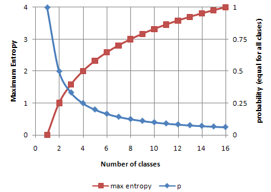
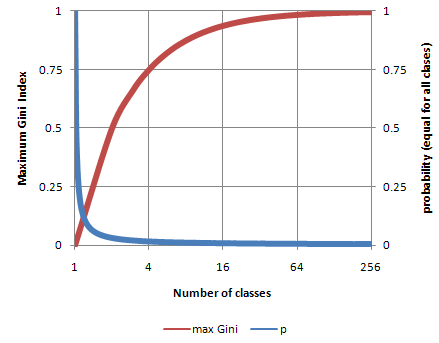

# Machine Learning

## We can predict ... YOU WISH!

Machine is not learning .
We **COMPUTE** the parameter of a hypothesis about our **OBSERVATION** , when the hypothesis is complicated, we use machine to do this.

## Convolution

## Sparsity

## VC dimension

## Entropy

The relation between maximum entropy and the number of states of a system, [here](http://people.revoledu.com/kardi/tutorial/DecisionTree/how-to-measure-impurity.htm)

The relation between maximum gini index and the number of state of a system.

Entropy is how much you need to know a state of a system. In other words, it is always about the unknown part of a system.

New unseen data ⇒ vc learning theory

## Bias and Variance

Following [here](http://people.revoledu.com/kardi/tutorial/DecisionTree/how-to-measure-impurity.htm)

Like every other model, a tree based model also suffers from the plague of bias and variance. Bias means, ‘how much on an average are the predicted values different from the actual value.’ Variance means, ‘how different will the predictions of the model be at the same point if different samples are taken from the same population’.
You build a small tree and you will get a model with low variance and high bias. How do you manage to balance the trade off between bias and variance ?
Normally, as you increase the complexity of your model, you will see a reduction in prediction error due to lower bias in the model. As you continue to make your model more complex, you end up over-fitting your model and your model will start suffering from high variance.

⇒  TO VC dimension ? or what ?

---
**NOTE**

-
It works with almost all markdown flavours (the below blank line matters).

-
---
